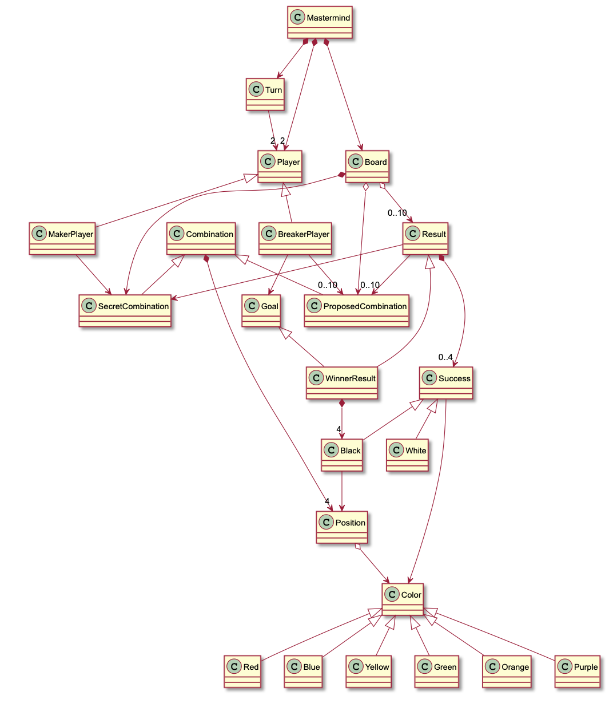

# Mastermind. Requisitos 1. Básica

## Integrantes de la práctica

* Alberto Eyo
* Álvaro Martín Martín

## Requisitos

Toda la informaciçon se encuentra en [wikipedia][1] o en [youtube][2].

* **Funcionalidad**: Básica
* **Interfaz**: Texto
* **Distribución**: Standalone
* **Persistencia**: No

## Modelo del dominio



## Prototipo de Interfaz

```
----- MASTERMIND -----

0 attempt(s):
xxxx
Propose a combination: rybgpo
Wrong proposed combination length
Propose a combination: rybÑ
Wrong colors, they must be: rbygop
Propose a combination: rybo

1 attempt(s):
xxxx
rybo --> 1 blacks and 1 whites
Propose a combination: byro

2 attempt(s):
xxxx
rybo --> 1 blacks and 1 whites
byro --> 2 blacks and 0 whites
Propose a combination: pgro

3 attempt(s):
xxxx
rybo --> 1 blacks and 1 whites
byro --> 2 blacks and 0 whites
pgro --> 4 blacks and 0 whites
You've won!!! ;-)
RESUME? (y/n): y
```

[1]: https://en.wikipedia.org/wiki/Mastermind_(board_game)
[2]: https://www.youtube.com/watch?v=2-hTeg2M6GQ